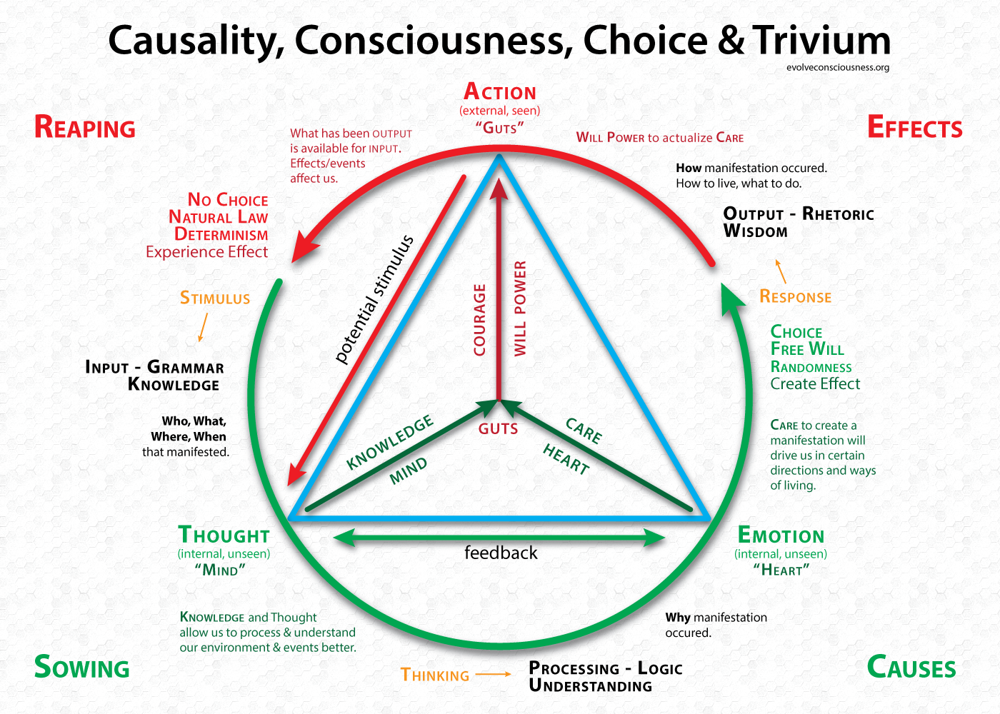

# Identify vulnerabilities

There is no way to measure the success of security awareness programs unless the behaviours that need to change are (continuously) identified. Without that, clear, actionable strategies are not possible.

|  |
|:--:|
| Credit: [evolveconsciousness](https://evolveconsciousness.org/causality-consciousness-choice-and-trivium/) |

Measuring security awareness program success is about building an evaluation framework that uses surveys, simulated events, event logging and monitoring, and assessments to test training effectiveness from multiple perspectives, including those of participants and facilitator. And nothing will work if management does not create an environment in which people trust leadership to be fair, honest, and transparent. Include perceptions on those attributes in the evaluation framework too.

And then get going making security fun, growing security thinking, care and guts, while tracking progress from currently perceived state to desired state.
