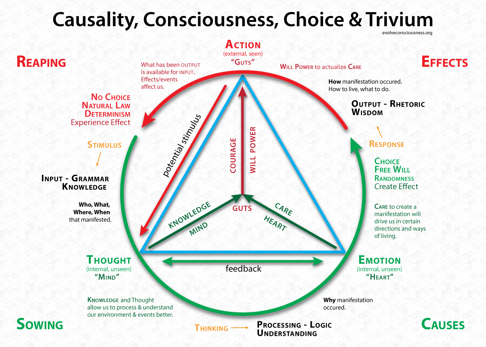

Laws of the forest
======================================================

The forest, huge and wild, a digital landscape formed by nature's own processes and humanoid activities and neglect
throughout decades. The forest does have human-made laws and inescapable natural law though.

Conventional pentesting covers the finding of most technical vulnerabilities. The limitations on such
processes include time and budget constraints, a limited scope, every effort being made to make the tests as
non-disruptive as possible, and having a heavy IT focus. Real adversaries do not follow such ethical codes and
are mostly unrestricted in their actions.

That does not mean pentesting is useless. We recommend having done enough pentesting and security awareness training
before considering red teaming, unless you think you are already the target of an
`APT adversary <https://green.tymyrddin.dev/projects/soup/en/latest/docs/apt.html>`_.

   https://evolveconsciousness.org/causality-consciousness-choice-and-trivium/

We are offering free services to NGO's and activists. And free does not necessarily mean our services are of low value.
On the contrary. `Contact us <https://uu.tymyrddin.dev/registration/>`_ in the Unseen University to discover how we
could work together. You do not have to wear a pointy hat or grow a beard. We just use unserious seriousness (or was
it serious unseriousness) to maintain our sanity when in paranoia mode.

.. toctree::
   :glob:
   :maxdepth: 1
   :includehidden:
   :caption: Pentesting

   docs/pentesting/README.md
   docs/pentesting/who.md
   docs/pentesting/contracts.md
   docs/pentesting/disclaimers.md
   docs/pentesting/scoping.md
   docs/pentesting/roe.md
   docs/pentesting/targets.md
   docs/pentesting/scheduling.md
   Cloud pentesting policy restrictions <https://red.tymyrddin.dev/projects/cloud/en/latest/docs/challenges/policies.html>

.. toctree::
   :glob:
   :maxdepth: 1
   :includehidden:
   :caption: Raising security awareness

   docs/awareness/README.md
   docs/awareness/identify.md
   docs/awareness/guides.md
   docs/awareness/workshops.md
   docs/awareness/simulations.md

.. toctree::
   :glob:
   :maxdepth: 1
   :includehidden:
   :caption: Red Teaming

   docs/redteaming/README.md
   docs/redteaming/flags.md
   docs/redteaming/who.md
   docs/redteaming/adversary.md
   docs/redteaming/scope.md
   docs/redteaming/roe.md
   docs/redteaming/planning.md
   docs/redteaming/conops.md
   docs/redteaming/resources.md
   docs/redteaming/operations.md
   docs/redteaming/mission.md

.. toctree::
   :glob:
   :maxdepth: 1
   :includehidden:
   :caption: Security operations

   docs/soc/README.md
   docs/soc/plan.md
   docs/soc/sirt.md
   docs/soc/communications.md
   docs/soc/nutshell.md
   docs/soc/soc.md
   docs/soc/metrics.md

.. toctree::
   :glob:
   :maxdepth: 1
   :includehidden:
   :caption: Forest writeups

   docs/writeups/README.md
   Red team writeups <https://red.tymyrddin.dev/>
   Blue team writeups <https://blue.tymyrddin.dev/>
   Green team writeups <https://green.tymyrddin.dev/>

.. toctree::
   :caption: Links

   Red team <https://red.tymyrddin.dev/>
   Blue team <https://blue.tymyrddin.dev/>
   Green team <https://green.tymyrddin.dev/>
